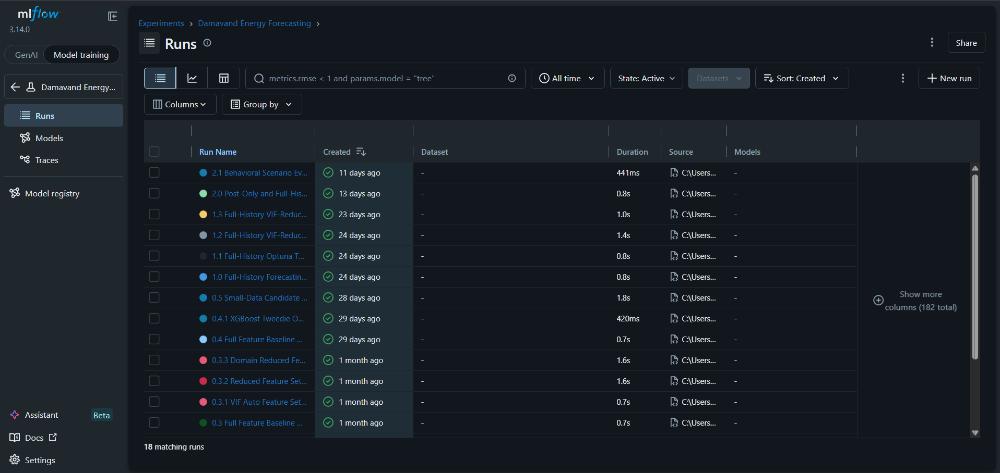
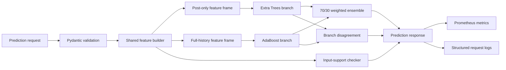
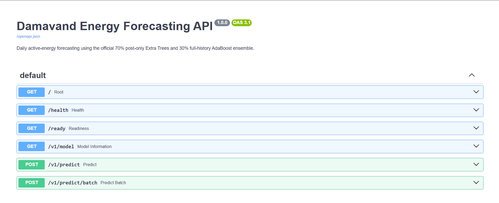

# Damavand Energy Forecasting Platform

A production-style machine-learning system for daily industrial active-energy forecasting, independently developed after the completion of a professional Measurement & Verification engagement in the same industrial setting.

This repository presents a separate forecasting and MLOps project that I designed and implemented after leaving Senerqon. It uses the curated daily analytical data foundation that I originally created for the Damavand M&V work, but it addresses a different objective, applies different models and validation rules, and delivers a complete forecasting API and release-engineering system.

> **Current status:** release candidate<br>
> **Official forecasting model:** Version 2.0<br>
> **Behavioral evaluation:** Version 2.1<br>
> **API version:** 1.0.0

## Professional project context

During my time at Senerqon, I independently completed the AI-based Measurement & Verification work for the Damavand project.

The client data was originally provided at production-order and batch level, while active-energy consumption was measured daily. I transformed those records into a unified daily analytical dataframe through temporal alignment, daily aggregation and operational feature engineering. I then developed and validated the CatBoost counterfactual baseline model, prepared the technical report, presented the methodology and answered two rounds of reviewer questions.

The accepted M&V analysis estimated the counterfactual energy consumption that would have occurred without the intervention and verified savings of 11.89% against a guaranteed target of 10.10%. Acceptance of the technical submission was a critical milestone in formally closing the wider professional engagement.

After leaving Senerqon, I independently developed the separate forecasting and MLOps project presented in this repository. The forecasting project uses the same curated daily data foundation because the underlying industrial source data had not changed, but it answers a different question and has its own model-development, validation, serving and governance lifecycle.

| Project | Objective | Model and outcome |
|---|---|---|
| Professional M&V project | Estimate the counterfactual energy consumption that would have occurred without the intervention and verify achieved savings | Pre-intervention CatBoost baseline; accepted after presentation and two rounds of review; verified 11.89% savings |
| Independent forecasting project | Predict future daily energy consumption from planned production, operating and calendar inputs | Governed 70/30 Extra Trees–AdaBoost ensemble, FastAPI service, Docker deployment, safeguards, testing and observability |

The two projects share their industrial setting and curated data foundation, but they are separate technical systems with different purposes.

See the [professional M&V case-study summary](CASE_STUDY.md) for the complete chronology and the supporting redacted model report, reviewer Q&A and reference letter.


## Portfolio highlights

| Area | Evidence |
|---|---|
| Professional M&V delivery | End-to-end AI baseline model accepted after presentation and two rounds of technical review; verified 11.89% savings against a 10.10% target |
| Data foundation | Production-order and batch-level records transformed by me through temporal alignment, daily aggregation and operational feature engineering into a unified energy-aligned analytical dataframe|
| Forecasting problem | Daily industrial active-energy forecasting under a known process intervention |
| Data design | Approximately 466 curated chronological daily observations spanning pre- and post-intervention operating regimes |
| Official model | Governed 70% post-only Extra Trees and 30% full-history AdaBoost ensemble |
| Forecasting performance | Validation: MAE 861.033 kWh and MAPE 4.668%; final holdout: MAE 1,022.456 kWh, MAPE 6.214%, and 1.751% aggregate deviation |
| Behavioral evaluation | 20 scenarios, 17 tests, 27 runtime hard checks, and 8 of 8 directional checks passed |
| Serving | FastAPI single and batch inference with shared feature construction |
| Safeguards | Artifact checksum verification, metadata validation, input-support diagnostics, calendar coverage, and branch disagreement |
| Operations | Docker packaging, structured logs, Prometheus metrics, and automated container acceptance testing |
| Reproducibility | Exact model hash and reference prediction reproduced on an independent clean machine |
| Automated testing | 60 tests passing on the release candidate |


## Independent forecasting and MLOps ownership

After completing the original professional M&V work, I independently designed and implemented the separate forecasting and MLOps system represented by this repository.

This was not a narrow modeling contribution or tutorial reconstruction. I took the forecasting project from problem framing and regime-change analysis through model governance, API implementation, testing, containerization, observability, reproducibility validation, and release hardening.

I personally designed and implemented:

- the intervention-aware chronological validation strategy;
- the governed 70/30 ensemble-selection process;
- model comparison, sensitivity analysis, bootstrap evaluation, and behavioral stress testing;
- MLflow experiment tracking and provenance records;
- the FastAPI single and batch inference service;
- shared feature construction for inference and diagnostics;
- input-support, calendar-coverage, and branch-disagreement safeguards;
- model metadata validation and SHA-256 artifact-integrity verification;
- automated Python tests and Docker acceptance testing;
- Prometheus operational metrics and structured request logging;
- independent clean-machine reproducibility validation;
- release hardening, repository configuration, and CI preparation.

## Technology stack

```text
Python 3.12
scikit-learn
pandas and NumPy
FastAPI, Pydantic, and Uvicorn
MLflow
pytest and httpx
Docker
Prometheus client
Git and GitHub Actions
```

## Reviewer quick paths

### Recruiter or hiring manager

1. [`CASE_STUDY.md`](CASE_STUDY.md) — professional M&V delivery, technical acceptance, and relationship between the two projects;
2. [`docs/MODEL_CARD.md`](docs/MODEL_CARD.md) — forecasting purpose, results, governance, and evidence boundaries;
3. [`docs/API_CONTRACT.md`](docs/API_CONTRACT.md) — exact implemented service behavior;
4. [`docs/validation/clean_machine_acceptance_test.md`](docs/validation/clean_machine_acceptance_test.md) — independent reproducibility evidence.

### Model-development reviewer

1. [`src/train_ensemble.py`](src/train_ensemble.py) — official branch training, 70/30 weight selection, final refitting, evaluation, and artifact creation;
2. [`src/model_ensemble.py`](src/model_ensemble.py) — official Extra Trees and AdaBoost configurations, ensemble weights, and weighted-prediction logic;
3. [`src/train.py`](src/train.py) — post-intervention model comparison and development workflow;
4. [`src/train_full_history.py`](src/train_full_history.py) — full-history branch comparison, evaluation, and artifact generation;
5. [`src/compare_final_models.py`](src/compare_final_models.py) — component and ensemble comparison evidence;
6. [`src/stress_test_ensemble.py`](src/stress_test_ensemble.py) — Version 2.1 replay, sensitivity, adversarial, and safeguard evaluation;
7. [`docs/Modeling_notes.md`](docs/Modeling_notes.md) — complete model-development history, decisions, and rejected alternatives.

### Serving and MLOps reviewer

1. [`src/serving/prediction_service.py`](src/serving/prediction_service.py) — ensemble inference and diagnostics;
2. [`src/serving/model_loader.py`](src/serving/model_loader.py) — artifact, checksum, and metadata validation;
3. [`src/serving/feature_builder.py`](src/serving/feature_builder.py) — shared feature construction;
4. [`src/api/app.py`](src/api/app.py) — API lifecycle, routes, and request handling;
5. [`src/api/metrics.py`](src/api/metrics.py) — bounded-label Prometheus instrumentation;
6. [`tests/`](tests/) — automated unit and integration evidence;
7. [`scripts/smoke_test_container.ps1`](scripts/smoke_test_container.ps1) — end-to-end container acceptance.

## Why a separate forecasting system was developed

The original professional M&V model answered a counterfactual question:

> What would energy consumption have been without the intervention?

The independent forecasting project answers a different operational question:

> Given the planned production and operating conditions, what daily energy consumption should be expected next?

The distinction required a separate model-selection, validation, serving, and governance workflow.

The objective is to forecast daily active electrical energy consumption from production, operating, and calendar information.

A known installation or process intervention occurred on:

```text
2025-09-12
```

That event created two operating regimes:

- older full-history data provides more observations but may reflect the earlier process;
- post-intervention data is more representative of the current operating regime but is limited.

The final system addresses this by combining two complementary models rather than treating the full history as one unchanged population.

## Official model

The production forecast is a constrained weighted ensemble:

```text
70% post-only Extra Trees
30% full-history AdaBoost
```

Calculation:

```text
official_prediction =
    0.70 * post_only_prediction
    + 0.30 * full_history_prediction
```

The 70/30 blend was selected using validation performance from a predefined post-only-dominant comparison. The final seven-day test period was not used to choose the official weight.

A 60/40 blend remains documented as a sensitivity challenger. It was not promoted simply because it performed better on the small final test window.

## Dataset and chronological evaluation

The daily analytical data foundation was originally created by me for the professional M&V project.

The raw client data contained production-order and batch-level records, while active-energy measurements were available at daily resolution. I resolved this mismatch by:

- aggregating production records into one operational record per day;
- aligning daily production activity with daily active-energy consumption;
- calculating physically interpretable production, operating-time, Brix, order-complexity, efficiency and calendar features;
- evaluating and excluding identifiers that were unstable, excessively granular or unsuitable at daily level.

Because the underlying industrial source data had not changed, the independent forecasting project uses the same curated daily dataframe. It applies a separate forecasting objective, chronological split policy, feature-governance process and model-selection workflow.

The forecasting dataset contains approximately 466 daily observations covering:


```text
2024-06-01 to 2025-10-31
```

Post-intervention model selection used:

```text
Training:   30 rows
Validation:  7 rows
Test:        7 rows
```

The split is chronological. No random train/test shuffling is used.

## Official performance

### Validation

| Metric | Result |
|---|---:|
| MAE | 861.033 kWh |
| RMSE | 1,036.787 kWh |
| R² | 0.809 |
| MAPE | 4.668% |
| Aggregate deviation | 0.634% |

### Final holdout test

| Metric | Result |
|---|---:|
| MAE | 1,022.456 kWh |
| RMSE | 1,282.704 kWh |
| R² | 0.755 |
| MAPE | 6.214% |
| Aggregate deviation | 1.751% |

The final test contains only seven days, so these results should be interpreted together with the wider behavioral and replay evidence.

## Behavioral evaluation

Version 2.1 evaluates model behavior through:

```text
8 historical representative-profile replays
8 controlled local +5% operating-scale perturbations
4 adversarial or out-of-distribution scenarios
```

Key verification results:

```text
17 behavioral unit tests passed
27 runtime hard checks passed
8 of 8 local directional checks passed
0 flat local responses
0 behavioral-evaluation warnings
```

Historical replay summary:

| Metric | Result |
|---|---:|
| Profiles | 8 |
| MAE | 695.559 kWh |
| RMSE | 847.874 kWh |
| MAPE | 3.110% |
| Mean signed deviation | +463.970 kWh |
| Aggregate deviation | +1.560% |

Historical replay is supplementary representative-profile evidence after refitting. It is not independent out-of-sample accuracy evidence.

## Experiment tracking and provenance

Intentional model-development and behavioral-evaluation runs were tracked with MLflow.

The tracked evidence includes:

- candidate estimators and feature sets;
- chronological validation and final holdout metrics;
- ensemble weights and challenger comparisons;
- bootstrap uncertainty summaries;
- behavioral scenario metrics;
- diagnostic figures and reports;
- exact source, configuration, and test artifacts.

Official Version 2.1 behavioral-evaluation run:

```text
c07bfa3a352f49e3b85bb838e62bdee7
```

The local MLflow database and artifact store are intentionally excluded from the repository. The run identifier is retained as provenance and is not presented as a publicly hosted MLflow experiment.

### Experiment history

<p align="center">
  
</p>

<p align="center"><em>MLflow experiment history showing the progression from early baselines to the governed Version 2.0 model and Version 2.1 behavioral evaluation.</em></p>

## System architecture



The serving path creates engineered features once and reuses them for both model branches and support diagnostics.

## API

The FastAPI service exposes:

| Method | Endpoint | Purpose |
|---|---|---|
| `GET` | `/` | Service information |
| `GET` | `/health` | Web-process health |
| `GET` | `/ready` | Validated model readiness |
| `GET` | `/v1/model` | Active model metadata |
| `POST` | `/v1/predict` | Single daily forecast |
| `POST` | `/v1/predict/batch` | Ordered batch forecasts |
| `GET` | `/metrics` | Prometheus operational metrics |
| `GET` | `/docs` | Interactive OpenAPI documentation |

### Interactive API surface

<p align="center">
  
</p>

<p align="center"><em>The interactive OpenAPI interface exposes service checks, validated model metadata, and single and batch forecasting operations. The Prometheus endpoint remains intentionally outside the human-facing Swagger schema.</em></p>

### Request example

```json
{
  "date": "2025-10-31",
  "total_kg": 190741,
  "total_nominal_kg": 190631.01,
  "total_brix_units": 1931393,
  "total_hours": 58.93,
  "total_pallets": 0,
  "orders": 4,
  "avg_brix": 10.1411869
}
```

### Reference response

```json
{
  "date": "2025-10-31",
  "modeling_version": "2.0",
  "target": "active_energy_kWh",
  "prediction_kwh": 18424.13407399847,
  "post_only_prediction_kwh": 18971.65182261905,
  "full_history_prediction_kwh": 17146.592660550457,
  "branch_disagreement_kwh": 1825.0591620685918,
  "branch_disagreement_pct": 10.106023635334983,
  "branch_disagreement_status": "moderate",
  "operational_range_status": "inside_typical_development_range",
  "calendar_coverage_status": "contains_unseen_calendar_values",
  "tail_features": [],
  "outside_range_features": [],
  "unseen_calendar_features": [
    "week_of_year=44"
  ],
  "warning_codes": [
    "UNSEEN_CALENDAR_VALUE",
    "MODERATE_BRANCH_DISAGREEMENT"
  ]
}
```

## Serving safeguards

### Artifact integrity

The approved model is tracked at:

```text
models/ensemble_2_0_model.joblib
```

SHA-256:

```text
A4A7945CA5E77387BAB3854597F380F8445B35849EF3B640B340507B26112282
```

The API verifies this checksum before deserializing the Joblib artifact.

After loading, it also validates:

- modeling version;
- target;
- estimator classes;
- ensemble weights;
- feature names;
- feature order;
- weight sum.

Startup fails if the serving metadata and model artifact do not match.

### Input-support diagnostics

Every prediction reports whether operational inputs are:

```text
inside_typical_development_range
development_distribution_tail
outside_observed_range
```

Calendar values are also checked against values represented during development.

Warnings are diagnostic. They do not block prediction generation.

### Branch disagreement

The API reports the absolute and percentage difference between the two model branches.

Classification:

| Disagreement | Status |
|---:|---|
| Below 10% | `low` |
| 10% to below 20% | `moderate` |
| 20% or above | `high` |

Branch disagreement is a behavioral diagnostic, not a confidence interval or calibrated error probability.

## Operational metrics

The `/metrics` endpoint exposes aggregated Prometheus metrics for:

- HTTP request totals by method, route, and status;
- request-duration histograms;
- successful single and batch prediction records;
- operational-range classifications;
- calendar-coverage classifications;
- branch-disagreement classifications;
- warning-code totals.

The metrics do not store raw industrial inputs, individual forecasts, or actual energy values.

## Run locally with Python

### Requirements

- Python 3.12
- Git

### Windows PowerShell

Create and activate the project environment:

```powershell
python -m venv .venv

Set-ExecutionPolicy `
  -Scope Process `
  -ExecutionPolicy RemoteSigned

.\.venv\Scripts\Activate.ps1
```

Install the development and test dependencies:

```powershell
python -m pip install --upgrade pip
python -m pip install --requirement requirements-dev.txt
```

Confirm the active interpreter:

```powershell
python -c "import sys; print(sys.executable)"
```

Start the API:

```powershell
python -m uvicorn src.api.app:app `
  --host 127.0.0.1 `
  --port 8000
```

Open the interactive API:

```text
http://127.0.0.1:8000/docs
```

Verify service health and model readiness from a second terminal:

```powershell
Invoke-RestMethod -Uri "http://127.0.0.1:8000/health"
Invoke-RestMethod -Uri "http://127.0.0.1:8000/ready"
```

Run the complete automated test suite:

```powershell
python -m pytest -q
```

## Run with Docker

### Build

```powershell
docker build --tag jmm-energy-api:local .
```

### Start

```powershell
docker run --detach `
  --name jmm-energy-api `
  --publish 8000:8000 `
  jmm-energy-api:local
```

### Verify

```powershell
Invoke-RestMethod -Uri "http://127.0.0.1:8000/health"
Invoke-RestMethod -Uri "http://127.0.0.1:8000/ready"
```

Interactive API documentation:

```text
http://127.0.0.1:8000/docs
```

Prometheus metrics:

```text
http://127.0.0.1:8000/metrics
```

### Stop and remove

```powershell
docker stop jmm-energy-api
docker rm jmm-energy-api
```

## Automated validation

### Python test suite

```powershell
python -m pytest -q
```

Current result:

```text
60 passed
```

The test suite covers:

- API validation and responses;
- feature construction;
- input-support classification;
- artifact integrity and metadata validation;
- prediction-service behavior;
- behavioral stress-test utilities;
- operational metrics.

### Full Docker smoke test

```powershell
.\scripts\smoke_test_container.ps1 `
  -HostPort 8011 `
  -NoCache
```

The script automatically:

1. verifies the Docker engine;
2. builds the image;
3. starts a temporary container;
4. waits for readiness;
5. checks `/health` and `/ready`;
6. verifies the approved reference prediction;
7. verifies batch ordering and consistency;
8. verifies `/metrics`;
9. removes the temporary container even after failure.

## Continuous integration

The repository includes:

```text
.github/workflows/ci.yml
```

The GitHub Actions workflow is configured for pushes, pull requests, and manual execution.

It runs two dependent jobs:

1. **Python 3.12 tests**
   - checks out the repository;
   - installs the pinned development dependencies;
   - runs the complete automated test suite.

2. **Docker serving smoke test**
   - builds the image without using the Docker build cache;
   - starts an isolated container;
   - verifies health and model readiness;
   - checks the approved reference prediction;
   - checks ordered batch consistency;
   - verifies Prometheus metrics;
   - removes the temporary container after success or failure.

The Docker job runs only after the Python test job succeeds, preventing container acceptance from masking basic test failures.

## Independent reproducibility

The project was cloned from a Git bundle and rebuilt on a separate Windows computer that had not been used for development.

The independent test confirmed:

- clean repository reconstruction;
- required serving files present;
- matching model checksum;
- Docker build from scratch;
- healthy container startup;
- working health and readiness endpoints;
- exact reference prediction reproduction;
- deterministic single/batch consistency.

See:

[`docs/validation/clean_machine_acceptance_test.md`](docs/validation/clean_machine_acceptance_test.md)

## Project structure

```text
.github/workflows/           GitHub Actions continuous integration
assets/                      README visual evidence
config/serving/              Serving metadata and input reference
docs/                        Modeling, API, governance, and validation records
models/                      Approved serving artifact
scripts/                     Reproducibility and smoke-test utilities
src/api/                     FastAPI application, schemas, and metrics
src/serving/                 Feature construction, artifact loading, and inference
tests/                       Automated unit and integration tests
.dockerignore                Container build exclusions
.gitattributes               Repository line-ending policy
Dockerfile                   Serving container definition
pyproject.toml               Pytest discovery and project test configuration
requirements-serving.txt     Runtime-only dependencies
requirements-dev.txt         Development and test dependencies
```

## Documentation

- [Professional M&V case-study summary](CASE_STUDY.md)
- [Redacted professional M&V evidence](docs/case_study/)
- [Detailed modeling notes](docs/Modeling_notes.md)
- [Model Card](docs/MODEL_CARD.md)
- [API Contract](docs/API_CONTRACT.md)
- [Independent clean-machine acceptance test](docs/validation/clean_machine_acceptance_test.md)

## Evidence boundaries

The project distinguishes between different forms of evidence:

- chronological validation and holdout testing are the primary generalization evidence;
- historical replay is representative-profile fit evidence;
- synthetic scenarios are behavioral diagnostics;
- the 70-operating-day synthetic batch-integration test provides API, Docker, ordering and warning-system evidence; holiday and planned non-operating dates were intentionally excluded;
- Docker and clean-machine tests are reproducibility and serving evidence;
- Prometheus metrics demonstrate observability capability, not live production history.

No synthetic result is presented as real forecast accuracy.

## Known limitations

- The post-intervention branch was trained on 30 observations.
- The chronological validation and final holdout windows contain seven days each.
- Post-intervention calendar and seasonal coverage remain limited by the available observations.
- Forecasting assumes that the required production and operating variables are available as planned or scheduled inputs.
- Forecasts containing tail, outside-range, or unseen-calendar diagnostics require additional operational interpretation.
- Accuracy, ensemble weights, and support boundaries should be re-evaluated as materially new post-intervention observations become available.

## Project positioning

This repository presents a complete industrial forecasting and MLOps system:

> A containerized daily energy-forecasting service with regime-aware model governance, chronological validation, automated testing, artifact-integrity controls, operational safeguards, Prometheus observability and independent clean-machine reproducibility.

Together, the repository and its professional case-study evidence demonstrate two separate capabilities:

- delivery and technical defence of an accepted business-facing AI model;
- independent development of a production-style forecasting and MLOps system.

## What this demonstrates about me

### Machine-learning judgment

I can identify when standard modeling assumptions no longer hold, redesign validation around a real regime change, work responsibly with limited post-intervention data, and select a model using predefined evidence rather than final-test opportunism.

### Production ML engineering

I can convert an offline forecasting model into a typed inference service with shared feature construction, deterministic ensemble logic, artifact validation, integrity checks, operational-range diagnostics, and explicit failure behavior.

### Software-engineering discipline

I can structure ML code into testable modules, define API contracts, write automated unit and integration tests, package the system with Docker, and prepare continuous integration that verifies both Python behavior and the running container.

### Reliability and observability

I can add health and readiness checks, structured request logging, bounded-label Prometheus metrics, deterministic reference predictions, batch-consistency checks, and automated cleanup after failed acceptance tests.

### Reproducibility and governance

I can connect a released model to its metadata, checksum, experiment record, validation evidence, and deployment configuration, then verify the complete system on a clean independent machine.

### Technical ownership and communication

I can take an ambiguous industrial forecasting problem from initial investigation to a release-ready engineering system, while documenting trade-offs, rejected alternatives, evidence boundaries, and known limitations honestly.

Taken together, the project demonstrates end-to-end ownership across applied machine learning, backend engineering, MLOps, testing, observability, reproducibility, and technical documentation.

## Portfolio and usage notice

This repository is publicly available for professional review and portfolio demonstration.

No open-source licence is granted. The absence of a licence means that no general permission is provided to copy, modify, redistribute, sublicense, or commercially reuse the project beyond rights provided by applicable law and GitHub's platform terms.

The repository intentionally excludes the raw industrial dataset, credentials, personal data, internal communications, MLflow databases, and private runtime logs.
